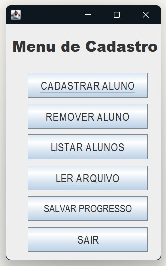
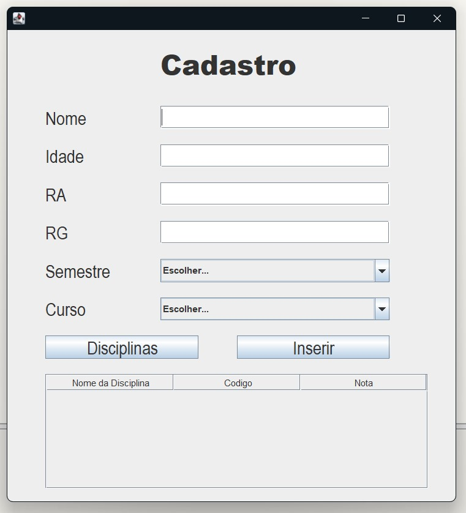
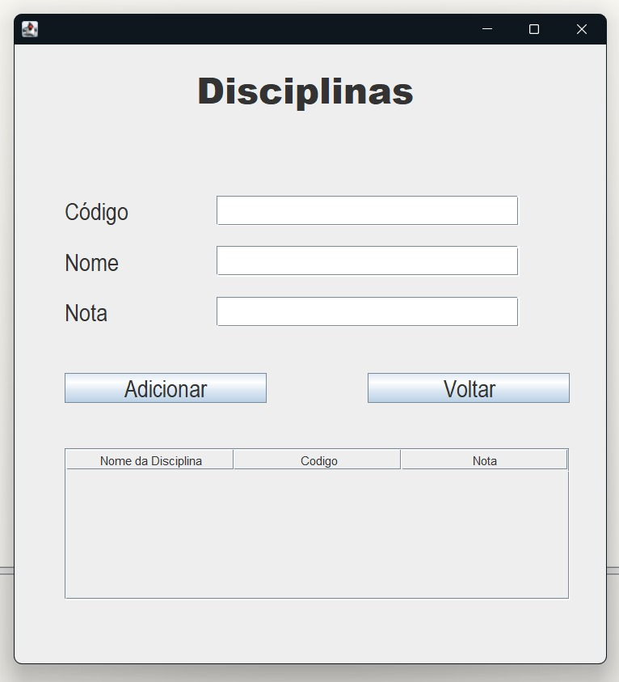
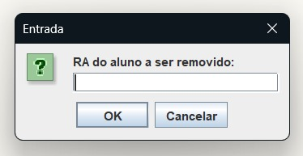
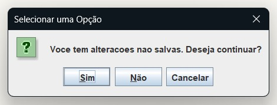
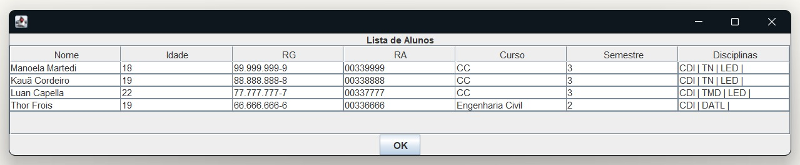
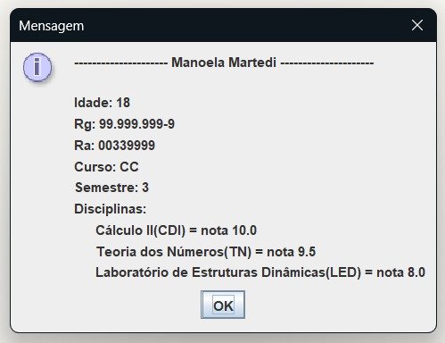

# STUDENT MANAGEMENT SYSTEM (Java)

## Description 
Group project that consisted of creating a student management system using Java.
The project was developed using JPane and the BlueJ IDE.

## Interface
### Main Page
This section describes the user interface of our Java project. It is designed to be intuitive and user-friendly. Below are the key functionalities accessible through the graphical interface:

#### 1. CADASTRAR ALUNO (Register Student):
- Allows users to input details such as name, age, RG (ID), Student Registration Number (RA), semester, and course to register new students in the system.

#### 2. REMOVER ALUNO (Remove Student):
- Users can search for a student by their RA and remove them from the system.
  
#### 3. LISTAR ALUNOS (List Students):
- Displays a list of all registered students.

#### 4. LER ARQUIVOS (Read Files):
- Functionality related to reading data from files.

#### 5. SALVAR PROGRESSO (Save Progress):
- Allows users to save their current progress to a file on their computer.

#### 6. SAIR (Exit):
- Exits the registration menu.

## Technical Details
In this section, we’ll cover the technical aspects of our project:

#### 1. Data Structures Choice:
- By modifying a commented line in the cadastro package's Cadastro class, users can switch between using a dynamic vector or an array list to store student information.

#### File Persistence:
- Our project supports file persistence, allowing users to save and retrieve their progress seamlessly.

#### Preloaded Data File:
- The main project includes a file named "alunosCadastrados.ser" containing pre-entered student data for testing purposes.

## Interface Images

  
    
Main menu.
  
  
  
    
Registering a new student and their respective subjects. Added in table.
  
  
  
    
Options for removing a registered student and for closing without saving, respectively.
  
  
    
Example of a list of registered students.
  
  
    
The user can view specific information for each student by clicking on their name in the list.
  

## Contributions
Kauã Cordeiro Cavalheiro

Luan Bonasorte Capella

Teacher Julio Arakaki

#### The project was coded using Java.
